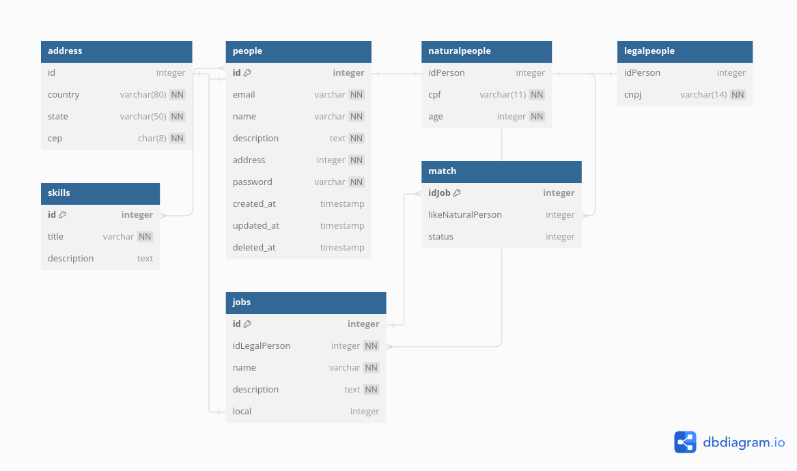

# Projeto de Banco de Dados - Linketinder

Este projeto implementa um banco de dados PostgreSQL para a aplicação Linketinder, uma plataforma que conecta pessoas em busca de oportunidades profissionais.

**Tecnologias:**

* PostgreSQL: Banco de dados relacional
* Docker Compose: Ferramenta para orquestrar containers

**Estrutura do Banco de Dados:**

* **Tabelas:**
    * `address`: Endereços
    * `person`: Pessoas (físicas e jurídicas)
    * `naturalperson`: Pessoas físicas
    * `legalperson`: Pessoas jurídicas
    * `skills`: Habilidades
    * `jobs`: Vagas
    * `match`: Matches entre pessoas e vagas

* **Relacionamentos:**
    * Uma pessoa possui um endereço
    * Uma pessoa pode ter várias habilidades
    * Uma vaga é oferecida por uma pessoa jurídica
    * Uma pessoa pode se candidatar a várias vagas
    * Uma vaga pode ter vários candidatos

**Dependencias do Docker Compose:**

* `postgres:14-alpine`: Imagem do PostgreSQL
* `dpage/pgadmin4`: Imagem do PgAdmin

**Como executar o projeto:**

1. Instale o Docker e o Docker Compose.
2. Clone este repositório.
3. Crie um arquivo `.env` na raiz do projeto com as seguintes variáveis:

```
POSTGRES_USER=postgres
POSTGRES_PASSWORD=postgres
POSTGRES_DB=linketinder
```

4. Execute o comando `docker-compose up -d` para iniciar os containers do PostgreSQL e PgAdmin.
5. Acesse o PgAdmin em `http://localhost:16543` usando o login e senha `admin@example.com/admin`.
6. Conecte-se ao banco de dados `linketinder` usando o servidor `postgres` e porta `5432`.
7. Importe o arquivo `init.sql` no PgAdmin para inicializar o banco de dados com dados fictícios.

**Observações:**

* O arquivo `init.sql` é apenas um exemplo e pode ser modificado de acordo com suas necessidades.
* As variáveis de ambiente no arquivo `.env` podem ser personalizadas.

**Links Úteis:**

* Documentação do PostgreSQL: [https://www.postgresql.org/docs/](https://www.postgresql.org/docs/)
* Documentação do Docker Compose: [https://docs.docker.com/compose/](https://docs.docker.com/compose/)
* PgAdmin: [https://www.pgadmin.org/](https://www.pgadmin.org/)

**Próximos Passos:**

* Implementar a lógica de negócio da aplicação Linketinder.
* Integrar o banco de dados com a aplicação frontend.
* Monitorar o desempenho do banco de dados.

**Modelo Entidade Relacionamento**
